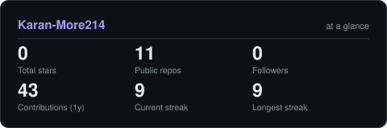

<!-- BANNER - terminal profile.sh --live. Generated by scripts/banner/generate.py
     from assets/source/portrait.png. Cache-bust with ?v=N after regenerating. -->
<picture>
  <source media="(prefers-color-scheme: dark)"  srcset="assets/banner-dark.v9.svg">
  <source media="(prefers-color-scheme: light)" srcset="assets/banner-light.v9.svg">
  
</picture>

 

<!-- NAME / TAGLINE - animated typing -->

 

<!-- SOCIALS -->
&nbsp;&nbsp;

 

&nbsp;
&nbsp;

---

## This is me :)

Hi, I'm **Karan More**, a developer from Maharashtra, India 🇮🇳.
I like turning ideas into working software, from database-backed systems to
responsive web pages and machine learning notebooks.

- ☕ **Java developer**: core Java, OOP, JVM fundamentals and interview-ready problem solving.
- 🗄️ **Database design with MySQL**: built [Bank](https://github.com/Karan-More214/Bank-Management-System-using-MySQL) and [Railway](https://github.com/Karan-More214/Railway-Management-System) management systems with DDL, DML and DQL.
- 🤖 Exploring **Machine Learning** in Python: data cleaning, EDA and models in my [ML-Projects](https://github.com/Karan-More214/ML-Projects).
- 🌐 Building **responsive front ends** with HTML5, CSS3 and Bootstrap 5.
- 🌱 **Currently learning:** DSA, backend development and deeper ML.
- 💬 Ask me about **Java, SQL or ML** and you'll have my full attention.
 

## my perfect stack`

---

## signals 

<table>
<tr>
<td width="50%" align="center" valign="middle">

<!-- Self-rated radar - edit assets/skills.json, the workflow redraws it -->
<picture>
  <source media="(prefers-color-scheme: dark)"  srcset="assets/radar-dark.svg">
  <source media="(prefers-color-scheme: light)" srcset="assets/radar-light.svg">
  
</picture>

</td>
<td width="50%" align="center" valign="middle">

<!-- Hand-authored language radar - edit assets/langmix.json -->
<picture>
  <source media="(prefers-color-scheme: dark)"  srcset="assets/radar-langs-dark.svg">
  <source media="(prefers-color-scheme: light)" srcset="assets/radar-langs-light.svg">
  
</picture>

</td>
</tr>
</table>

---

## Numbers matter? ohhh yes. 

<!-- Generated by scripts/cards.py via the "Charts and cards" workflow. -->
<picture>
  <source media="(prefers-color-scheme: dark)"  srcset="assets/card-stats-dark.svg">
  <source media="(prefers-color-scheme: light)" srcset="assets/card-stats-light.svg">
  
</picture>

 

---

` Build with love · @Karan-More214 `

